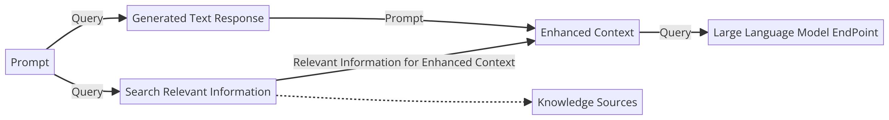
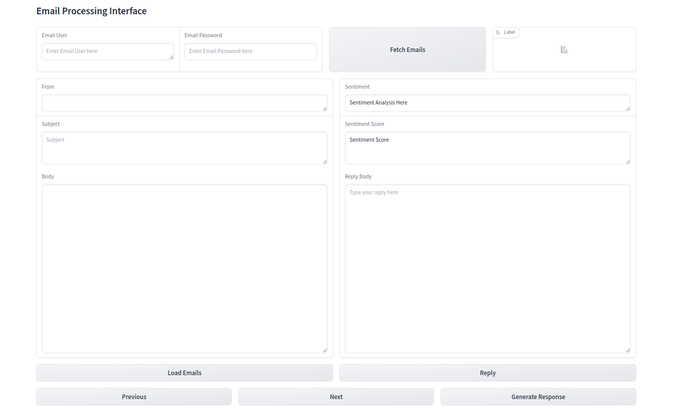

# Email Response Automation Application

## Overview
This application is designed to automate the process of reading and responding to emails. It uses machine learning models to analyze the content of the emails and generate appropriate responses. The application is configurable, allowing users to set up custom response prompts through the `config.py` file.



 

## Code Structure

- **Data**: Contains the PDF Knowledge Base used for creating vector database.
- **Email_Reader**: Scripts for reading emails from a file or email server.
  - `email_reader.py`: Reads emails from the source.
  - `email_response.py`: Processes the emails and drafts responses.
- **Logs**: Logs from the application execution.
- **Utils**: Utility scripts that support the main application functions.
  - `loaders.py`: For loading data and models.
  - `logging.py`: Logging utility.
  - `text_processing.py`: Text preprocessing and analysis.
  - `vector_db.py`: Handles the vector database operations.
  - `vectorstores.py`: Manages vector storage.
- `config.py`: Configuration script to set up custom prompts.
- `ingest.py`: Script to ingest and process the data to create the vector database.
- `interface.py`: Defines the Gradio app interface.
- `requirements.txt`: Lists all the dependencies for the application.

## Configuration

Modify the `config.py` to change the email prompts according to your requirements. This allows you to tailor the automation process to fit the nature of your email correspondence.

## Vector Database

Use the `ingest.py` script to create and maintain a vector database. This database is crucial for the application to analyze and process emails efficiently.

## Gradio App

Run the `interface.py` script to start the Gradio web application. This interface provides a user-friendly way to interact with the email automation system.

## Getting Started

1. Install the required dependencies:
   ```sh
   pip install -r requirements.txt
   ```
2. Set up your email data source and configure the `config.py` file with your custom prompts.
3. Use `ingest.py` to create the vector database.
4. Run `interface.py` to start the Gradio interface and begin automating your email responses.

## Contribution

Contributions to this project are welcome. Please fork the repository, make your changes, and submit a pull request.
